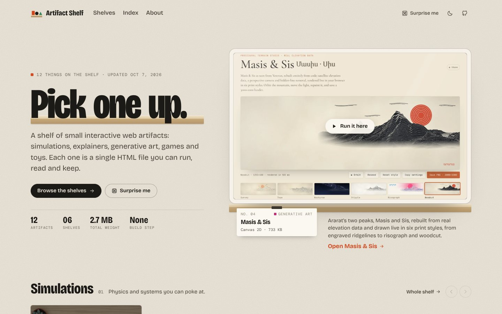

# Artifact Shelf

Small interactive things, each one a single HTML file.

**[dogum.github.io/artifact-shelf](https://dogum.github.io/artifact-shelf/)**

Simulations, explainers, generative art, games and toys, made in conversation with
Claude and kept on a shelf where anyone can pick one up, run it, read how it works and
take the file home.



## What's here

Every artifact gets:

- **A place on a shelf.** Items stand on a ledge with a paper tag clipped to the edge:
  number, title, what it's made of, how big it is. Hover one and it lifts off the shelf
  and wakes up as a live miniature.
- **Its own page.** The artifact runs in a framed stage with Restart, Fullscreen, Open on
  its own, Download .html, Source, Share and Embed. Under it is a writeup (what it is,
  how to use it, how it works) and a label with its details.
- **Everything a search engine wants.** Real text, a canonical URL, Open Graph cards
  with a screenshot, `WebApplication` structured data, a sitemap, an Atom feed, a JSON
  catalog and `llms.txt`.


## How it's built

One Node script, no runtime dependencies, no framework. It reads `artifacts/`, writes
static HTML to `dist/`, and GitHub Pages serves it.

```
artifacts/
  <slug>/
    index.html     the artifact, a complete single-file page
    about.md       front matter (title, summary, shelf, tags…) + the writeup
media/<slug>/      poster.webp, poster-640.webp, og.jpg  (from npm run capture)
pages/about.md     the About page
shelf.config.json  site title, URL, author, the shelves
src/
  build.mjs        the generator
  lib/             front matter, markdown, tech sniffing, loading
  templates/       layout, pages, the shelf/tag/card parts
  assets/          shelf.css, shelf.js, fonts, favicon
tools/
  add.mjs          put a new artifact on the shelf
  check.mjs        lint artifacts and writeups
  capture.mjs      headless-Chromium posters and share cards
  serve.mjs        local server with live reload
skill/             a Claude skill that does the whole shelving routine
```

The output is plain HTML and CSS with a small script for enhancements (live hover
previews, the index filter, view transitions between a card and its page). With
JavaScript off, everything still reads and links.

## Commands

```bash
npm run dev              # build, serve at localhost:4173, rebuild + reload on save
npm run add -- file.html --shelf toys   # new artifact (starts as a draft)
npm run check            # lint everything; `npm run check -- <slug>` for one
npm run capture          # posters for anything new or changed (needs Playwright)
npm run build            # dist/ for deployment
npm run build:portable   # dist/ that opens straight from disk
npm test                 # build + check every link, JSON-LD block and feed
npm run test:browser     # same, plus open every page in headless Chromium
HOST=0.0.0.0 npm run dev # try it on your phone over Wi-Fi
```

`npm install && npx playwright install chromium` once, for `capture`. Nothing else
needs installing.

## Adding an artifact

1. `npm run add -- ~/Downloads/thing.html --shelf games`
2. Write `artifacts/<slug>/about.md` following [docs/WRITEUPS.md](docs/WRITEUPS.md),
   then set `status: published`.
3. `npm run check -- <slug>`, `npm run capture -- <slug>`, `npm run dev` and look at it.
4. Commit and push. The workflow builds and deploys.

Or hand Claude the artifact with the skill in [skill/artifact-shelf](skill/artifact-shelf/SKILL.md)
installed and say "shelve this".

`status` controls visibility: `published` is listed everywhere, `unlisted` is built and
reachable by URL but kept out of listings and the sitemap, `draft` isn't built at all.
Anything you don't want in the public repo yet goes in `drafts/`, which git ignores.

## Deploying

1. Create the GitHub repo and push.
2. Settings → Pages → Source: **GitHub Actions**.
3. Each push to `main` runs `.github/workflows/deploy.yml`: check, capture anything
   missing, build, deploy.

**Custom domain:** set `url` to `https://yourdomain.com` and `base` to `/` in
`shelf.config.json`, add the domain under Settings → Pages, and point DNS at GitHub.

**Search:** add the site to [Google Search Console](https://search.google.com/search-console),
submit `sitemap.xml`, and put the verification code in `shelf.config.json` as
`"verification": { "google": "…" }`.

## Make your own shelf

Fork it, empty `artifacts/` and `media/`, edit `shelf.config.json` and `pages/about.md`,
and drop your own single-file artifacts in.

## License

Code: MIT. Each artifact is © its author and shared under the same license unless its
page says otherwise. Fonts: SIL Open Font License.
