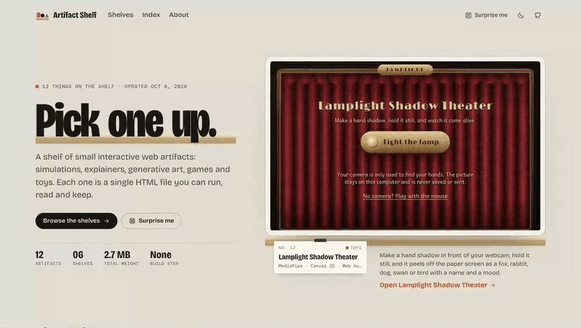
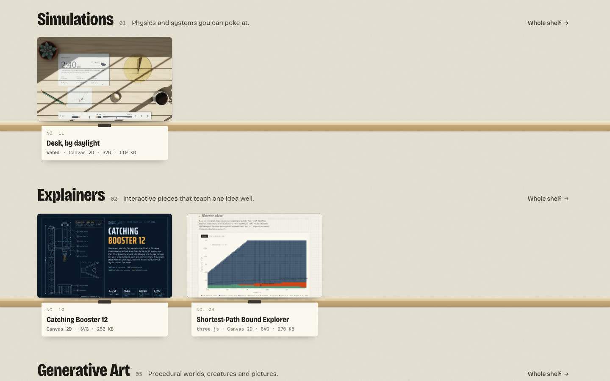
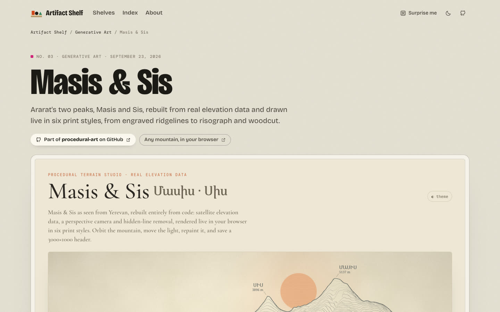
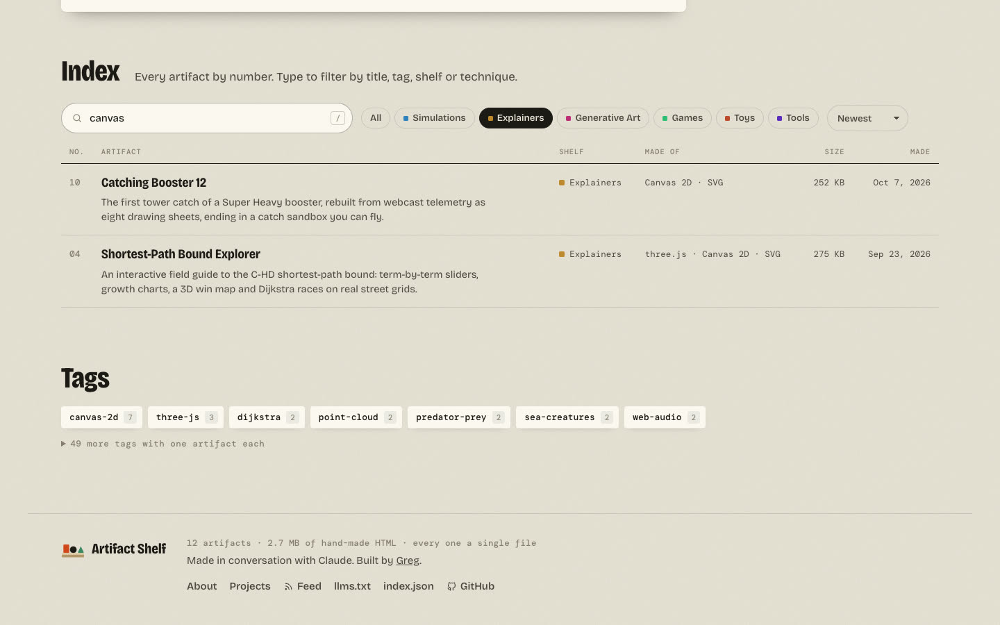
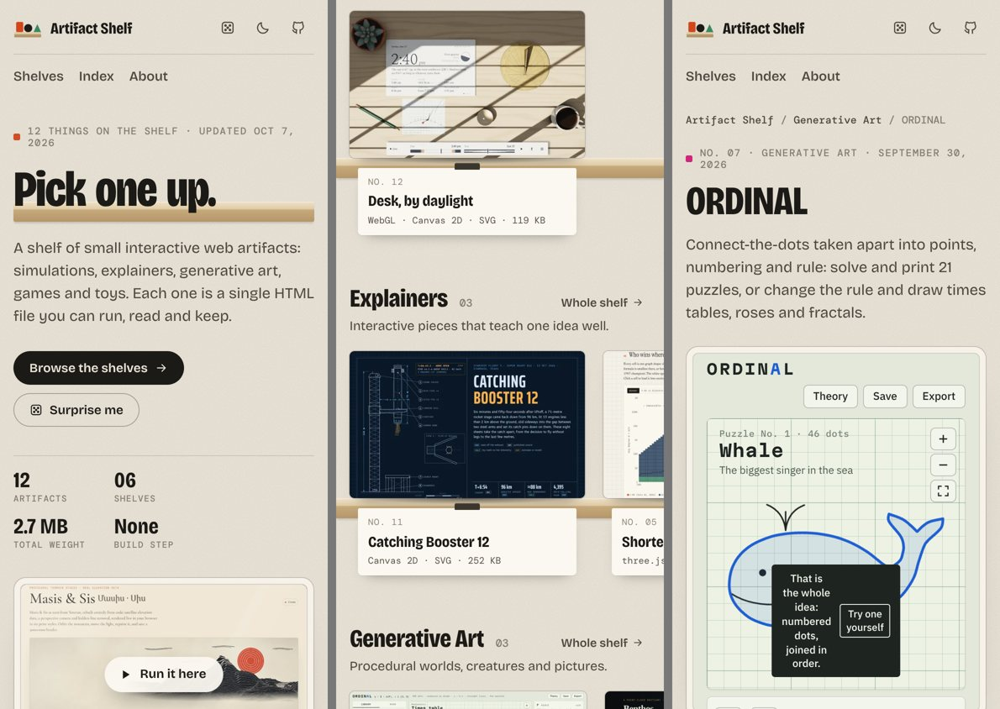

<div align="center">

# Artifact Shelf

**A gallery for single-file HTML artifacts, generated by one Node script with no dependencies.**

Simulations, explainers, generative art, games and toys, each one a single HTML file you can run, read and keep.



[](https://github.com/dogum/artifact-shelf/actions/workflows/deploy.yml)
[](LICENSE)
[](package.json)
[](#shelving-with-claude)

**[Visit the shelf](https://dogum.github.io/artifact-shelf/)** · **[Make your own shelf](#make-your-own-shelf)** · **[Changelog](CHANGELOG.md)**

</div>

---

I make small interactive pages in claude.ai and elsewhere, and an artifact link is a poor way to share one: it opens on its own, with no name, no explanation and nothing next to it. This repo is the one place they live instead. Every artifact gets a spot on a shelf, a page with a writeup, a poster, a download button and a URL that search engines can read.

## On the shelf

| Shelf | Artifacts |
|---|---|
| Simulations | [Belousov's Clock](https://dogum.github.io/artifact-shelf/a/belousovs-clock/): the Belousov–Zhabotinsky reaction run live, with waves you tap and cut into spirals<br>[Kármán's Street](https://dogum.github.io/artifact-shelf/a/karmans-street/): vortex shedding in a live lattice-Boltzmann wind tunnel<br>[A Great Variety of Colours](https://dogum.github.io/artifact-shelf/a/great-variety-of-colours/): a soap film and bubble in exact thin-film colours as they drain and burst<br>[Klangfiguren](https://dogum.github.io/artifact-shelf/a/klangfiguren/): Chladni figures from the plate equation, with up to 131,072 grains of sand<br>[Letters from the Sky](https://dogum.github.io/artifact-shelf/a/letters-from-the-sky/): snow crystals grown on the GPU and steered through Nakaya's diagram<br>[Desk, by daylight](https://dogum.github.io/artifact-shelf/a/desk-by-daylight/): a desk lit by the real sun and moon for any place and time |
| Explainers | [Catching Booster 12](https://dogum.github.io/artifact-shelf/a/catching-booster-12/): the first Super Heavy tower catch as eight drawing sheets<br>[Shortest-Path Bound Explorer](https://dogum.github.io/artifact-shelf/a/shortest-path-bound-explorer/): the C-HD bound, term by term, with Dijkstra races on real streets<br>[Forced Blowup for Navier–Stokes](https://dogum.github.io/artifact-shelf/a/navier-stokes-forced-blowup/): how a smooth force can drive a fluid to a singularity, with live figures<br>[Grand Complication Atlas](https://dogum.github.io/artifact-shelf/a/grand-complication-atlas/): a working 3D grand complication pocket watch that keeps time from its own escapement |
| Generative Art | [ORDINAL](https://dogum.github.io/artifact-shelf/a/ordinal/): connect-the-dots puzzles, times tables, roses and fractals<br>[Benthos](https://dogum.github.io/artifact-shelf/a/benthos-gallery/): 34 sea creatures made of parametric points<br>[Masis & Sis](https://dogum.github.io/artifact-shelf/a/masis/): Ararat from real elevation data in six print styles, from [procedural-art](https://github.com/dogum/procedural-art) |
| Games | [Merrow Pocket Plan](https://dogum.github.io/artifact-shelf/a/merrow-pocket-plan/): a city map you fold like paper in 3D<br>[Infestation](https://dogum.github.io/artifact-shelf/a/infestation/): bugs eat the page's own source code, token by token<br>[Benthos reef](https://dogum.github.io/artifact-shelf/a/benthos-reef/): a one-minute predator-and-prey game |
| Toys | [Lamplight Shadow Theater](https://dogum.github.io/artifact-shelf/a/lamplight-shadow-theater/): hand shadows on a webcam come alive as animals<br>[Stave](https://dogum.github.io/artifact-shelf/a/stave/): a typeface drawn on twelve tuned strings |
| Tools | [Recipe Diagram](https://dogum.github.io/artifact-shelf/a/recipe-diagram/): a plain-text recipe drawn as a flow table, with scaling and a cook mode<br>[Mirror Cube Solver](https://dogum.github.io/artifact-shelf/a/mirror-cube-solver/): paint a mirror cube's shape, get a solution on a 3D model |

## What each artifact gets



**A place on a shelf.** Items stand on a ledge with a paper tag clipped to the edge: number, title, what it's made of, how big it is. On a desktop, hover one for about half a second and it lifts off the ledge and loads as a live miniature with a LIVE badge. Move away and the iframe is torn down, so a page of twenty items never runs more than one.



**Its own page.** The artifact runs in a framed stage with Restart, Fullscreen, Open on its own, Download .html, Source, Share and Embed (keys: `R`, `F`, `←`, `→`). Under it are a writeup (what it is, how to use it, how it works) and a label listing the libraries it uses, its size and line count. In Chrome and Safari 18.2+ the poster you clicked grows into the stage with a cross-document view transition.



**An index.** Every artifact in one table. Press `/` to search titles, tags and techniques, filter by shelf, sort by date, number, name or size. Filters live in the URL (`?q=canvas&shelf=explainers`), so a filtered view can be linked.



**Phones and dark mode.** Shelves scroll sideways on a phone, and the display window waits for a tap ("Run it here") instead of starting on its own. Dark mode swaps the plaster wall for a dark one and the birch ledges for walnut.

**Everything a search engine wants.** Real text on every page, a canonical URL, Open Graph cards with a screenshot, `WebApplication` structured data, a sitemap, an Atom feed, a JSON catalog (`index.json`) and `llms.txt`. With JavaScript off, everything still reads and links.

## Make your own shelf

The repo works as a template. Nothing in the generator is specific to these artifacts.

1. **Copy it.** Click **Use this template** on GitHub (or fork it), then clone your copy and install the one dev dependency:

   ```bash
   npm install && npx playwright install chromium
   ```

2. **Empty the shelf.**

   ```bash
   git rm -r -q artifacts media
   ```

   The build is happy with no artifacts; you get a home page with nothing on it yet.

3. **Edit `shelf.config.json`.**

   | Key | What to put there |
   |---|---|
   | `title`, `tagline`, `description` | Your site's name, a one-line tagline and a sentence for search results |
   | `url`, `base` | Where it's served. A project site is `"https://you.github.io"` and `"/your-repo/"`; a user site or custom domain uses `"/"` |
   | `author` | `{ "name": "…", "url": "…" }`, used in the footer and structured data |
   | `repo`, `branch` | Your repository URL and branch, for the Source buttons |
   | `madeWith` | The line under each label ("Made in conversation with Claude") |
   | `shelves` | Your categories: `id`, `name`, `blurb`, a `hue` (0–360) for its colour, and a schema.org `schemaCategory` |
   | `projects` | Bigger repos that some artifacts come from. A card appears only when a published artifact points at one with `repo:` |
   | `backlink` | `false` to drop the small "back to the shelf" pill on artifacts opened on their own |
   | `verification.google` | Your Search Console code, once you have it |

4. **Rewrite `pages/about.md`** in your own words, and change the name in `LICENSE`. `CLAUDE.md` describes this repo for coding agents; edit it or delete it.

5. **Add an artifact.**

   ```bash
   npm run add -- ~/Downloads/thing.html --shelf toys
   ```

   That creates `artifacts/<slug>/index.html` and a stub `about.md` with `status: draft`. Fill in the front matter and writeup ([docs/WRITEUPS.md](docs/WRITEUPS.md) has the fields and a style guide), set `status: published`, then:

   ```bash
   npm run check -- <slug>     # lint the file and the writeup
   npm run capture -- <slug>   # poster and share card from headless Chromium
   npm run dev                 # look at it at http://localhost:4173<base>
   ```

6. **Publish.** Push to GitHub, then set **Settings → Pages → Source** to **GitHub Actions**. Each push to `main` runs `.github/workflows/deploy.yml`: check, capture any poster you forgot, build, smoke-test, deploy.

`status` controls visibility: `published` is listed everywhere, `unlisted` is built and reachable by URL but kept out of listings, the sitemap and the feed, and `draft` isn't built at all. Anything you don't want in a public repo yet goes in `drafts/` (same layout as `artifacts/` and `media/`), which git ignores.

## Shelving with Claude

`skills/artifact-shelf` is a Claude skill that does the whole routine when you hand it an artifact link or file and say "shelve this": it reads the file, checks it for private material (work content, family names, local paths, dead `claude.ai/artifact` links, unguarded `window.claude` calls), adds it, looks at it in a headless browser, writes `about.md` to the style guide, captures the poster and shows you the result. It leaves it as a draft unless you say it can go public.

### Claude Code

```
/plugin marketplace add dogum/artifact-shelf
/plugin install artifact-shelf@artifact-shelf
```

### Claude.ai

Zip the `skills/artifact-shelf` folder and upload it under Settings → Capabilities → Skills.

## Commands

```bash
npm run dev              # build, serve at localhost:4173, rebuild and reload on save
HOST=0.0.0.0 npm run dev # same, reachable from a phone on your Wi-Fi (prints the URL)
npm run add -- f.html --shelf toys   # new artifact, starts as a draft
npm run check            # lint everything; `npm run check -- <slug>` for one
npm run capture          # posters for anything new or changed; --force for all, --cards for share cards only
npm run build            # dist/ for deployment
npm run build:portable   # dist/ that opens straight from disk or any subpath
npm test                 # build, then check every internal link, JSON-LD block and feed
npm run test:browser     # same, plus open every page in headless Chromium and fail on script errors
```

Node 20 or later. Playwright is the only dev dependency, and only `capture` and `test:browser` use it.

## How it's built

One Node script reads `artifacts/`, writes static HTML to `dist/`, and GitHub Pages serves it. No framework, no bundler, no markdown library: the front matter parser, the markdown renderer and the templates are a few hundred lines of plain JavaScript. The script also sniffs each artifact for what it's made of (WebGL, three.js, Web Audio, MediaPipe and so on), which feeds the paper tags, the label and the index search.

```
artifacts/<slug>/
  index.html             the artifact, a complete single-file page
  about.md               front matter and writeup
media/<slug>/            poster.webp, poster-640.webp, og.jpg, capture.json (from npm run capture)
pages/about.md           the About page
shelf.config.json        title, URL, author, shelves, projects
src/
  build.mjs              the generator
  lib/                   front matter, markdown, tech detection, loading
  templates/             layout, pages, and the shelf, tag and card parts
  assets/                shelf.css (design tokens at the top), shelf.js, fonts, favicon
tools/                   add, check, capture, serve, smoke
skills/artifact-shelf/   the companion Claude skill
.claude-plugin/          plugin.json and marketplace.json for it
docs/WRITEUPS.md         how to write an about.md
```

The output is plain HTML and CSS with one small script for enhancements: the live hover previews, the index filter and the view transitions. Each artifact is served twice, once inside its page and once on its own at `a/<slug>/play/`, and the original file is kept at `a/<slug>/<slug>.html` for the Download button.

## License

Code: [MIT](LICENSE). Each artifact is © its author and shared under the same license unless its page says otherwise. Fonts: Bricolage Grotesque and DM Mono, SIL Open Font License.
